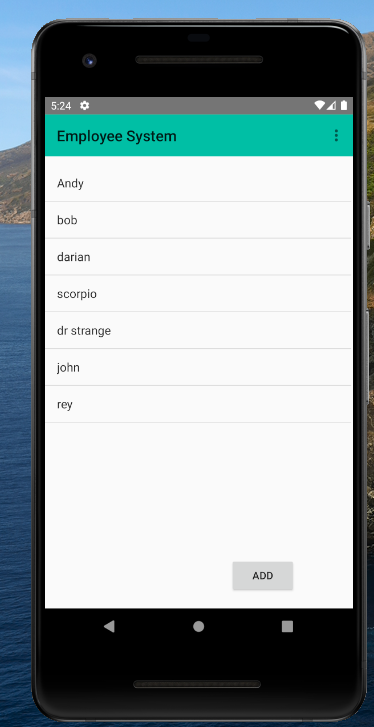
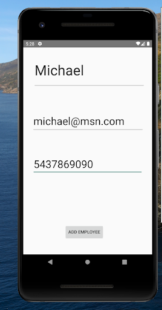
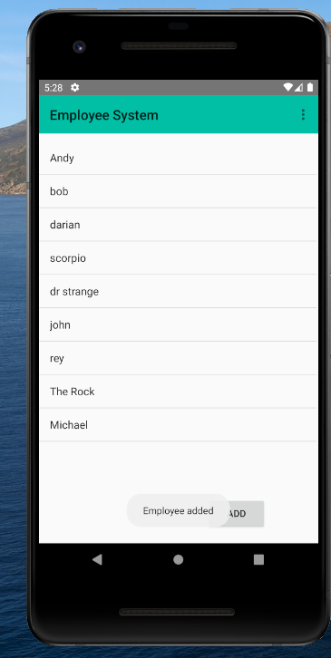
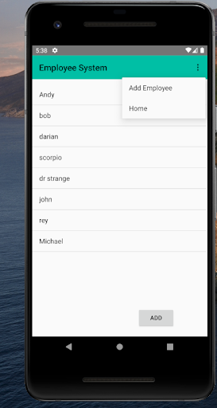
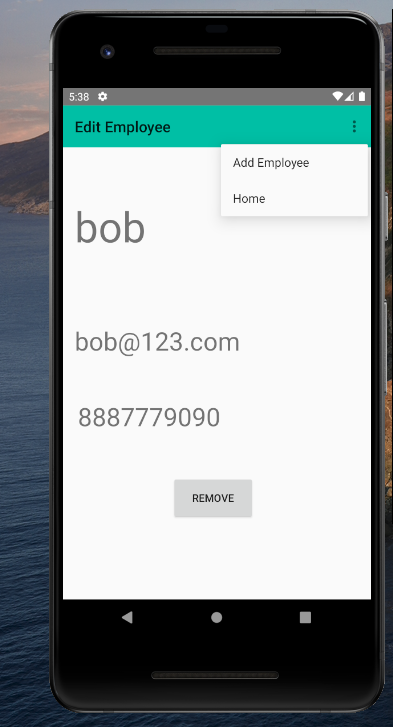

<h1>
Employee Management System</h1> 

 <h4>Introduction</h4> 
 <ul>
 <li>Employee Management System is an Android based application which can be used to manage Employees. </li> 
 <li>Users can view, add, and delete employee records. </li> 
  <li>Easy to manage employee details. </li> 
 </ul>  
 

<h4>Implementation</h4> 

<h4>App Screens</h4> 

<h3>Main</h3> 

<h3>Add</h3> 

<h3>Nav Bar</h3> 

